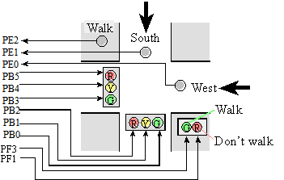
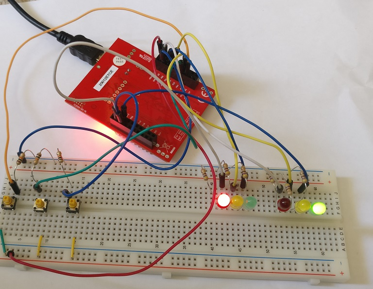

# Traffic Light Controller
My implementation of Lab 10 of Embedded Systems Change the World from Texas A&M.

It's a traffic light intersection where the lights adjust to handle traffic coming from the north/south road, the east/west road, and pedestrians. Each of the switches represents a sensor for where the traffic is. If more than one sensor is active, the lights will cycle through the active ones in a Round Robin fashion.

## Requirements

### Software
* Windows 7 or higher
* Keil uVision4 IDE (5 or higher won't work)

### Hardware
* TI Tiva C Series TM4C123GXL
* Breadboard + wires
* 3x Switches
* 3x 10kΩ resistors
* 6x LEDs (green/yellow/red)
* 6x 470Ω resistors

